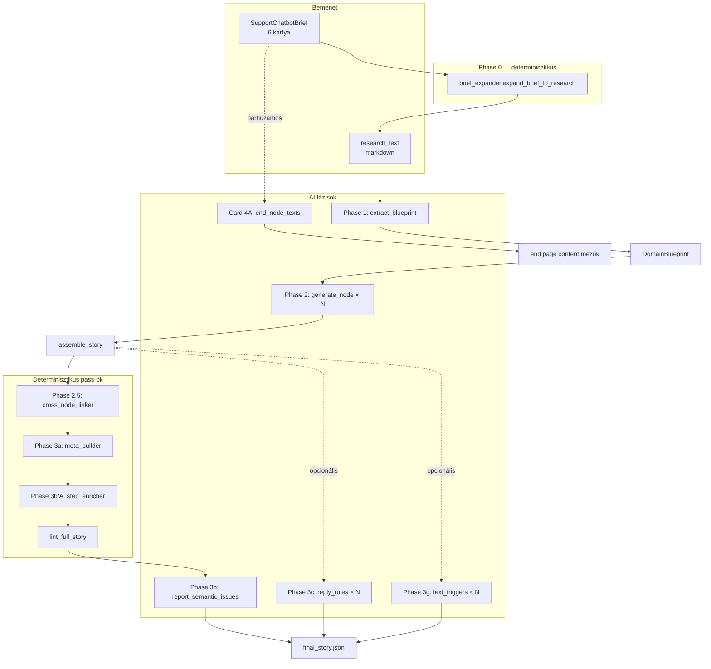

# AI Onboarding Pipeline — Teljes rebuild-specifikáció

> **Cél:** Egy másik agent vagy fejlesztő ebből a dokumentumból **újraalkothassa** a pipeline által generált support-chatbot demót (`ai_complaint_story_v3` szintű részletességgel), anélkül hogy a kódbázist kellene böngésznie.
>
> **Verzió:** 2026-06-17 · kódbázis: `D:/MarketingTool/backend`

---

## 1. Hatókör

### Benne van

| Terület | Leírás |
|---------|--------|
| **Phase 0** | Brief → `research_text` markdown (determinisztikus + opcionális AI enricher) |
| **Phase 1** | `extract_blueprint` — kutatási anyag → `DomainBlueprint` |
| **Phase 2** | Node-onkénti AI-generálás + `lint_single_node` retry |
| **Phase 2.5** | `cross_node_linker` — cross-node wiring |
| **Phase 3a** | `meta_builder` — OCM, labels, reply_style |
| **Phase 3b/A** | `step_enricher` — done_when, internal_conditions |
| **Phase 3b** | Szemantikus audit (`report_semantic_issues`) |
| **Phase 3c** | `reply_rules` generálás (opcionális, külön script) |
| **Phase 3g** | `text_triggers` generálás (opcionális, külön script) |
| **Card 4A** | 6 fix end-node ügyfél-szöveg (külön AI hívás) |
| **Runtime + ticket** | Story futtatás, end-page ticket építés (röviden) |

### Kifejezetten NINCS benne

- **Tudásbázis / embedding építés** (`POST /api/ai-node/build-embeddings`, `embedding_store.py`) — ez runtime előkészítés, nem onboarding pipeline fázis.
- Onboarding Coach UI logika részletei (csak API említés).

---

## 2. Architektúra — magas szint



### Orchestrator alapú futás (`POST /api/onboarding/brief/jobs/{id}/build`)

```
run_phase1 → run_phase2 → run_phase3a → run_phase3b
```

A `run_phase3a` belül: `assemble_story()` → `lint_full_story()`.

**Fontos:** A default build **NEM** futtatja a 3c és 3g fázisokat. Ezeket külön scripttel vagy `assemble_story(reply_rules_client=..., text_triggers_client=...)` hívással kell engedélyezni.

### Job állapotgép

```
brief_received → phase0_expanding → phase0_ready
  → blueprint_extracting → blueprint_ready
  → node_generating → structural_linting → semantic_auditing → done
```

Hibák: `failed_phase0`, `failed_blueprint`, `failed_generation`, `failed_lint`, `failed_audit`.

---

## 3. Fájl-térkép (single source of truth)

| Komponens | Fájl |
|-----------|------|
| Orchestrator | `services/onboarding/orchestrator.py` |
| Pydantic kontraktok | `services/onboarding/contracts.py` |
| Brief kontraktok (6 kártya) | `services/onboarding/brief_contracts.py` |
| Phase 0 expander | `services/onboarding/brief_expander.py` |
| Anthropic client + Phase 1/2/3b promptok | `services/onboarding/anthropic_client.py` |
| Tool JSON schemák | `services/onboarding/tool_schemas.py` |
| Constraint katalógus | `services/onboarding/constraints.py` |
| Cross-node linker | `services/onboarding/cross_node_linker.py` |
| Meta builder | `services/onboarding/meta_builder.py` |
| Step enricher | `services/onboarding/step_enricher.py` |
| Reply rules (3c) | `services/onboarding/reply_rules_generator.py` |
| Text triggers (3g) | `services/onboarding/text_triggers_generator.py` |
| End-node szövegek (4A) | `services/onboarding/end_node_text_generator.py` |
| Strukturális lint | `services/story_lint.py` |
| Story runtime | `services/story_runtime.py` |
| Ticket építés | `services/ticket_builder.py`, `services/ticket_integration.py` |
| API route-ok | `routers/onboarding_brief_routes.py` |
| Benchmark story | `stories/ai_complaint_story_v3.json` |
| SQLite perzisztencia | `data/onboarding.db` (`ONBOARDING_DB_PATH`) |

### CLI scriptek (PoC / manuális rebuild)

```bash
# backend/ könyvtárból, ANTHROPIC_API_KEY szükséges az AI scriptekhez

python scripts/onboarding_phase0_brief_smoke.py          # Phase 0 smoke
python scripts/onboarding_phase1_poc.py --docx PATH      # Phase 1 önálló
python scripts/onboarding_phase2_full_poc.py --blueprint PATH
python scripts/onboarding_phase3a_apply.py --story PATH --blueprint PATH
python scripts/onboarding_phase3c_full_apply.py --story PATH
python scripts/onboarding_phase3g_full_apply.py --story PATH
```

---

## 4. Bemenetek részletesen

### 4.1 SupportChatbotBrief (6 kártya)

A frontend `/dashboard/onboarding/new` oldalon kitöltött JSON. Pydantic modell: `SupportChatbotBrief`.

| Kártya | Modell | Tartalom |
|--------|--------|----------|
| Card 1 | `Card1CompanyBasics` | `vendor_name`, `locale` (hu/en), `business_model`, `target_market` |
| Card 2 | `Card2Operations` | Visszaküldés (2A), remedy hierarchia (2B), szállítás (2C) |
| Card 3 | `Card3Backend` | Helpdesk provider (discriminated union), SLA, urgency triggerek |
| Card 4 | `Card4Output` | 6 fix `EndNodeKind` slot + `scope_out_message` |
| Card 5 | `Card5Boundaries` | Off-topic limit, support elérhetőség |
| Card 6 | `Card6Sources` | 6 fix dokumentum-slot (priority címkékkel) |

**Card 4 `AiPrefilledText` állapotgép:** `empty` → `ai_generating` → `ai_prefilled` → `user_approved` / `user_edited`.

**Phase 0 kimenet (`BriefExpansionResult`):**
- `research_text` — markdown, 9 szekció
- `domain_name` — pl. `"Acme — Customer support intake"`
- `locale` — `hu` vagy `en`
- `vendor_policy` — mindig `"specific"` (brief flow)
- `vendor_name` — Card 1-ből

### 4.2 research_text markdown szerkezet (Phase 0 output)

A `brief_expander.render_brief_to_research_text()` ezeket a szekciókat építi:

1. `## Domain context`
2. `## Case families`
3. `## Cross-cutting policies`
4. `## Always-collect facts`
5. `## Vendor data integration`
6. `## SLA and urgency`
7. `## Out-of-scope`
8. `## Tone & style`
9. `## Attached source excerpts` (Card 6 dokumentumok)

**A Card 4 end_node_texts NEM kerül a research_text-be** — azok külön generálódnak (Card 4A).

### 4.3 DomainBlueprint (Phase 1 kimenet)

```json
{
  "locale": "hu",
  "domain_name": "Vendor — Customer support intake",
  "vendor_policy": "specific",
  "vendor_name": "Vendor",
  "summary": "3-5 mondat...",
  "nodes": [ /* NodeCandidate[] */ ],
  "conditions": [ /* ConditionCandidate[] */ ],
  "routing_sketches": [ /* RoutingSketch[] */ ],
  "external_data_deps": [ /* ExternalDataDep[] */ ],
  "proposed_new_external_fields": [ /* ProposedNewExternalField[] */ ],
  "end_pages": [ /* EndPageSpec[] */ ],
  "notes": [ "..." ]
}
```

**Kötelező node-ok (Phase 1 prompt):**
- Entry/dispatcher node (`complaint-intake` vagy analóg)
- Off-topic node (`off-topic`)

**External data pool:** Csak `KNOWN_OCM_FIELDS` (`story_lint.py`) — új mező → `proposed_new_external_fields`.

---

## 5. Fázisonkénti részletes specifikáció

### Phase 0 — Brief expansion

| | |
|---|---|
| **Típus** | Determinisztikus Python (+ opcionális `BriefExpanderClient`) |
| **Bemenet** | `SupportChatbotBrief` |
| **Kimenet** | `BriefExpansionResult` |
| **Függvény** | `expand_brief_to_research(brief, enricher=None)` |
| **API** | `POST /api/onboarding/brief/jobs` (sync) |

Az enricher opcionális: ha a kimenet < 200 karakter, fallback a determinisztikus verzióra.

---

### Phase 1 — Blueprint extraction

| | |
|---|---|
| **Típus** | AI tool-use |
| **Tool** | `extract_blueprint` |
| **Model** | `claude-sonnet-4-5-20250929` |
| **Max tokens** | 32000 |
| **Temperature** | 0.2 |
| **Retry** | max 1 (`RetryConfig.max_attempts_blueprint`) |

**Mit generál:** STRUKTURÁLIS jelöltek — NEM step definíciók, NEM reply_rules, NEM knowledge.description node-okhoz.

**Prompt forrás:** `anthropic_client.build_phase1_system_prompt()` + `build_phase1_user_message()`

---

### Phase 2 — Node generation

| | |
|---|---|
| **Típus** | AI tool-use, node-onként szekvenciálisan |
| **Tool** | `generate_node` |
| **Max tokens** | 8000 / node |
| **Retry** | max 3 / node (`RetryConfig.max_attempts_per_node`) |
| **Validáció** | `lint_single_node()` minden attempt után |

**GenerationContext mezők (orchestrator tölti):**
- `blueprint`, `target_node_candidate`
- `accepted_nodes_summary` — eddig elfogadott node-ok
- `accumulated_condition_pool` — cross-node condition pool
- `known_page_ids_so_far` — érvényes `goto` célok
- `retry_attempt_index`, `last_attempt_errors` — retry feedback

**AI-page output séma (minimum):**

```json
{
  "id": "delivery-issue",
  "type": "ai",
  "fallback_message": "...",
  "knowledge": {
    "description": "1-3 mondat",
    "scope": "1 mondat",
    "examples": ["...", "..."]
  },
  "conditions": [
    { "id": "has_order_id", "description": "...", "required": true }
  ],
  "routing": [
    { "if": ["package_lost"], "goto": "end-lost-package" },
    { "default": "ask" }
  ],
  "steps": [ /* opcionális, de ajánlott */ ],
  "condition_implications": [],
  "session_facts_whitelist": []
}
```

**Closing step bundle (kötelező ha `is_closing: true`):**
```json
{
  "is_closing": true,
  "is_terminal": true,
  "permit_goto_auto_ack": true,
  "silent_on_matched_goto": true,
  "fallback_reason": ">=10 karakter locale-ben"
}
```

**System prompt összetétele:**
1. `render_catalog_for_prompt(catalog)` — constraint katalógus markdown
2. `TARGET LOCALE` + vendor policy clause
3. `_PHASE2_INSTRUCTIONS` — teljes generálási utasítás (~200 sor)

---

### Phase 2.5 — Cross-node linker

| | |
|---|---|
| **Típus** | Determinisztikus, zero AI cost |
| **Függvény** | `link_cross_nodes(story)` |
| **Műveletek** | `complete_session_facts_whitelist`, `wire_cross_node_inject_conditions` |

**Logika:**
1. Ha cond A deklarálva node X-en, és node Y routing.if[] hivatkozik rá → X whitelist-be kerül
2. Cross-node `goto` rule-okra `inject_conditions` = (source ismert cond-ok) ∩ (target whitelist)

---

### Phase 3a — Meta builder

| | |
|---|---|
| **Típus** | Determinisztikus |
| **Függvény** | `apply_meta_builder(story, locale, extra_known_fields, ...)` |

**Generált meta szekciók:**
- `order_context_mapping.field_rules` — `has_*` / `*_known` pattern → `not_null` derive
- `order_context_mapping.computed_condition_ids`
- `condition_labels` — cond description-ből
- `reply_style` — locale-specifikus tone template
- `question_detection_hint`
- `validation_patterns` — regex ref-ek

---

### Phase 3b/A — Step enricher

| | |
|---|---|
| **Típus** | Determinisztikus |
| **Függvény** | `apply_step_enricher(story, locale)` |

**Pass-ok:**
1. `backfill_done_when` — Hu: `"X és Y teljesül"`, En: `"X and Y are satisfied"`
2. `expand_internal_conditions` — string ID → `{id, description, do_not_reask_if_satisfied: true}`
3. `apply_auto_satisfy_heuristic` — signal phrase detektálás a description-ben

**Auto-satisfy signal phrase-ek:**
- HU: tartalmazza `"ne várj ügyfél"` ÉS `"automatikusan teljesül"`
- EN: tartalmazza `"do not wait for"` ÉS `"automatically satisfied"`

---

### Phase 3a (lint) — Strukturális validáció

`lint_full_story(story, extra_known_external_fields=...)` — errors → `failed_lint`, job megáll.

---

### Phase 3b — Szemantikus audit

| | |
|---|---|
| **Típus** | AI tool-use |
| **Tool** | `report_semantic_issues` |
| **Max tokens** | 16000 |
| **Bemenet** | Teljes assembled story JSON |

**Finding típusok:** `routing_logic`, `condition_naming`, `node_overlap`, `missing_path`, `vendor_policy_violation`, `tone_or_style`, `scope_creep`, `data_dependency`

**Verdict → job status:**
- `clean` / `warnings_only` → `done`
- `needs_human_review` / `hard_fail` → `failed_audit`

---

### Phase 3c — Reply rules (opcionális)

| | |
|---|---|
| **Típus** | AI, node-onként |
| **Tool** | `generate_reply_rules` |
| **Max tokens** | 4000 / node |
| **Költség** | ~$0.015/node |

**Mit generál:** 2-5 imperative `reply_rules` / non-closing step.

**Anti-spoiler policy (MIXED):**
- Closing-adjacent step → HARD anti-spoiler
- Egyéb step → SOFT anti-spoiler

**Default production build:** KIHAGYVA. Futtatás: `onboarding_phase3c_full_apply.py`.

---

### Phase 3g — Text triggers (opcionális)

| | |
|---|---|
| **Típus** | AI, node-onként |
| **Tool** | `generate_text_triggers` |
| **Max tokens** | 4000 / node |

**Mit generál:** 3-8 lowercase substring trigger / eligible condition.

**Eligible:** natural language pattern cond-ok (`remedy_preference_known`, `defect_persists`, ...)
**Skip:** extract-style (`has_order_id`, `image_uploaded`, `consent_text_provided`, ...)

---

### Card 4A — End-node texts

| | |
|---|---|
| **Típus** | Külön AI hívás (NEM része run()-nak) |
| **Tool** | `generate_end_node_texts` |
| **Trigger** | `POST /api/onboarding/brief/jobs/{id}/end-nodes/generate` |
| **Bemenet** | Card 1 + Card 2 (+ opcionális Card 4 scope_out_message) |

**6 kötelező kulcs (`EndNodeKind`):**
`return_accepted`, `refund_initiated`, `replacement_initiated`, `warranty_investigation`, `lost_package`, `expired_return_deadline`

Minden érték: 30-800 karakter, 2-4 mondat, konkrét policy értékekkel.

**user_edited védelem:** `apply_generated_end_node_texts()` soha nem írja felül a `status="user_edited"` slotokat.

---

## 6. Kimenet — Story JSON séma

**Benchmark:** `stories/ai_complaint_story_v3.json` (`schemaVersion: "1.1.0"`)

Az orchestrator skeleton `schemaVersion: "1.0"`-t használ — a benchmark gazdagabb meta-val rendelkezik.

### Top-level

```json
{
  "schemaVersion": "1.1.0",
  "storyId": "ai-complaint-v3",
  "locale": "hu",
  "meta": { /* lásd alább */ },
  "pages": { "<page-id>": { /* ai vagy end */ } }
}
```

### meta (teljes demo-hoz szükséges)

```json
{
  "id": "...",
  "title": "...",
  "startPageId": "complaint-intake",
  "defaultFallbackMessage": "...",
  "runtime": {
    "model": "claude-sonnet-4-6",
    "max_tokens": 1000,
    "mock_today": "2026-05-15",
    "return_window_days": 30,
    "max_entry_skip_depth": 10,
    "max_routing_chain_depth": 5,
    "max_chain_hops": 8,
    "embedding_top_k": 3
  },
  "question_detection_hint": { "true_if": [], "false_if": [], "uncertain": "false" },
  "order_context_mapping": { "precedence_rules": [], "field_rules": [], "computed_condition_ids": {}, "session_state_keys": [] },
  "condition_labels": { "cond_id": "Emberi címke" },
  "reply_style": { "tone_rules": [], "ack_and_paragraph_instruction": "..." },
  "validation_patterns": { "order_id_pattern": "^..." }
}
```

### AI page (teljes)

| Mező | Kötelező | Leírás |
|------|----------|--------|
| `id`, `type: "ai"` | ✓ | |
| `fallback_message` | ✓ | 1-2 mondat |
| `knowledge` | ✓ | description, scope, examples |
| `conditions[]` | ✓ | Minden hivatkozott cond deklarálva |
| `routing[]` | ✓ | ≥1 default rule, AND-only if-rules |
| `steps[]` | ajánlott | identify → extract → exclude → route |
| `condition_implications[]` | opcionális | `{when_all, then}` |
| `session_facts_whitelist[]` | opcionális | cross-node propagation |
| `steps[].reply_rules[]` | 3c után | imperative directives |
| `conditions[].text_triggers[]` | 3g után | substring match phrase-ek |

### End page

```json
{
  "id": "end-refund-initiated",
  "type": "end",
  "content": "Ügyfélnek látható záró szöveg (Card 4A-ból)",
  "ticket": {
    "category": "refund_processing",
    "priority": "normal",
    "routing_target": "finance_team",
    "sla_hours": 48,
    "summary_template": "Refund for order {{order_id}}",
    "data_fields": ["order_id"],
    "evidence_conditions": ["refund_eligible", "has_order_id"],
    "customer_actions_required": [],
    "tags": [],
    "external_system": "zendesk"
  }
}
```

---

## 7. Constraint katalógus — kritikus szabályok

A Phase 2 és 3b system prompt elején megjelenik (`render_catalog_for_prompt`).

| Terület | Szabály |
|---------|---------|
| **Routing** | AND-only `if[]`, nincs negáció, 2-pass eval, `goto` ∈ pages ∪ `"ask"` |
| **Condition ID** | `snake_case`, 2-64 char |
| **Page ID** | `^[a-z][a-z0-9-]+$` |
| **Step types** | `prompt`, `info`, `decision`, `auto` |
| **OCM when** | `truthy`, `not_null`, `when_value`, `when_any_value` |
| **Closing bundle** | `is_closing` → mind az 5 mező kötelező |

Teljes katalógus: `constraints.build_constraint_catalog(proposed_external_fields)`.

---

## 8. Runtime és ticket (demo befejezéséhez)

### Story futtatás

- `POST /api/ai-node/process` — SSE streaming chat
- Aktív node megtartása ha van `satisfiedConditions` + `currentStepId`
- Routing: `story_runtime.resolve_ai_node_routing`

### Ticket generálás

Amikor `nextPageId` egy end page-re mutat:

```
emit_ticket_for_end_page(story, end_page_id, session_id, order_context, satisfied_conditions)
  → build_ticket() — template + context
  → JsonlFileTicketSink → data/tickets/{story_id}/{date}.jsonl
```

Idempotencia: `(session_id, end_page_id)` cache.

### Embedding (KÍVÜL a dokumentáción)

A teljes demo-hoz a node scope routing-hoz szükséges:
```bash
POST /api/ai-node/build-embeddings  { "story": <story_json> }
```
Ez Voyage AI-val generálja a `data/node_embeddings.json`-t.

---

## 9. Teljes rebuild runbook (lépésről lépésre)

### A) Brief-driven flow (production út)

```bash
cd backend
export ANTHROPIC_API_KEY=sk-...

# 1. Job létrehozás (Phase 0 sync)
curl -X POST http://localhost:8000/api/onboarding/brief/jobs \
  -H "Content-Type: application/json" \
  -d @fixtures/sample_brief.json

# 2. Card 4A end-node szövegek (opcionális, de demo-hoz ajánlott)
curl -X POST http://localhost:8000/api/onboarding/brief/jobs/{job_id}/end-nodes/generate

# 3. Teljes pipeline (Phase 1-3b, background)
curl -X POST http://localhost:8000/api/onboarding/brief/jobs/{job_id}/build

# 4. SSE progress
curl -N http://localhost:8000/api/onboarding/brief/jobs/{job_id}/events

# 5. Kész story lekérés
curl http://localhost:8000/api/onboarding/brief/jobs/{job_id}
# → final_story mező
```

### B) CLI-only rebuild (research_text / blueprint már megvan)

```bash
cd backend

# Phase 1 (ha nincs blueprint)
python scripts/onboarding_phase1_poc.py \
  --research-text data/research.md \
  --locale hu --domain-name "Demo Vendor" \
  --vendor-policy specific --vendor-name "Demo Vendor"

# Phase 2 (minden node)
python scripts/onboarding_phase2_full_poc.py \
  --blueprint data/onboarding/blueprint_<ts>.json
# → story_<ts>.json

# Phase 2.5 + 3a + 3b/A (determinisztikus, no API)
python scripts/onboarding_phase3a_apply.py \
  --story data/onboarding/story_<ts>.json \
  --blueprint data/onboarding/blueprint_<ts>.json
# → story_<ts>_phase3a.json

# Phase 3b szemantikus audit (külön, ha kell)
# → orchestrator.run_phase3b vagy API build

# Phase 3c reply_rules (~$0.20/full story)
python scripts/onboarding_phase3c_full_apply.py \
  --story data/onboarding/story_<ts>_phase3a.json

# Phase 3g text_triggers
python scripts/onboarding_phase3g_full_apply.py \
  --story data/onboarding/story_<ts>_phase3c.json
```

### C) Benchmark-szintű demo ellenőrzőlista

- [ ] ≥1 entry node (`complaint-intake`) + `off-topic` node
- [ ] Minden case family külön AI node
- [ ] Minden end outcome külön end page + ticket template
- [ ] `lint_full_story` → 0 error
- [ ] Phase 3c: minden non-closing step-en `reply_rules`
- [ ] Phase 3g: eligible cond-okon `text_triggers`
- [ ] Card 4A: 6 end-node `content` kitöltve
- [ ] `meta.order_context_mapping.field_rules` derive-olva
- [ ] Embedding build (runtime, külön lépés)
- [ ] `stories/` alá mentett JSON + backend reload

---

## 10. Konfigurációs konstansok

| Konstans | Érték | Hely |
|----------|-------|------|
| Default model | `claude-sonnet-4-5-20250929` | `AnthropicOnboardingClient` |
| Phase 1 max_tokens | 32000 | |
| Phase 2 max_tokens | 8000 | |
| Phase 3b max_tokens | 16000 | |
| Phase 3c/g max_tokens | 4000 | |
| Temperature | 0.2 | |
| max_attempts_per_node | 3 | `RetryConfig` |
| escalate_after_attempts | true | human review ha exhausted |
| ONBOARDING_DB_PATH | `backend/data/onboarding.db` | env |
| TICKETS_DIR | `backend/data/tickets` | env |

---

## 11. SZUPER-PROMPT — Agent számára (teljes pipeline újraalkotás)

> **Használat:** Másold be ezt a szekciót egy új agent system/user promptjába. A bemenet: egy kitöltött `SupportChatbotBrief` JSON VAGY egy kész `research_text` markdown. A kimenet: teljes futtatható story JSON + 6 end-node szöveg.

---

```
TE EGY CUSTOMER-SERVICE STORY GENERÁTOR VAGY.

A feladatod: egy support chatbot teljes "story" JSON-jét előállítani,
amely kompatibilis a MarketingTool story runtime-mal (ai_complaint_story_v3
benchmark szintű részletesség).

═══════════════════════════════════════════════════════════════
KIZÁRT A FELADATBÓL
═══════════════════════════════════════════════════════════════
- Node embedding / tudásbázis index építés (azt külön API hívás intézi)
- Frontend UI implementáció

═══════════════════════════════════════════════════════════════
BEMENET
═══════════════════════════════════════════════════════════════
Vagy:
  A) SupportChatbotBrief (6 kártya: company, operations, backend, output,
     boundaries, sources)
Vagy:
  B) research_text markdown (9 szekció: Domain context, Case families,
     Cross-cutting policies, Always-collect facts, Vendor data integration,
     SLA and urgency, Out-of-scope, Tone & style, Attached source excerpts)

Metadata:
  - locale: hu | en
  - domain_name: string
  - vendor_policy: specific | generic_blended | mock
  - vendor_name: string (ha specific/mock)

═══════════════════════════════════════════════════════════════
FÁZISOK — SZIGORÚ SORREND
═══════════════════════════════════════════════════════════════

─── PHASE 0 (ha Brief van, nem research_text) ───
Alakítsd a brief-et research_text markdown-dá. 9 szekció. Konkrét policy
számokat írj be (napok, SLA órák, remedy sorrend). A Card 4 end_node_texts
NE kerüljön a research-be.

─── PHASE 1: extract_blueprint ───
SYSTEM PROMPT LOGIKA:
- Te domain deconstructor vagy. STRUKTÚRÁT adsz, nem teljes node-okat.
- Döntsd el az ai-node és end-page számot a komplexitás alapján (nincs kvóta).
- Mindig legyen: entry/dispatcher node (pl. complaint-intake) + off-topic node.
- external_data_deps: CSAK KNOWN_OCM_FIELDS pool (order_id, purchase_date,
  tracking_number, tracking_status, payment_method, return_initiated_date,
  return_received_date, refund_initiated_date, refund_eta_date, prior_case_id,
  extended_warranty_active, sold_battery_threshold, accessories_in_order,
  estimated_delivery_date, ... — lásd story_lint.KNOWN_OCM_FIELDS).
- Új mező → proposed_new_external_fields + rationale.
- conditions: id + description_seed (1-2 mondat), cross_node_handoff_targets.
- end_pages: id, purpose, ticket_category, priority, routing_target, sla_hours,
  evidence_conditions.
- rule_kind: truthy | not_null | when_value | when_any_value.
- notes: explicit ambiguitások, kitalált értékek.

TOOL OUTPUT: DomainBlueprint JSON (lásd contracts.py).

─── PHASE 2: generate_node (MINDEN NodeCandidate-re, SORRENDBEN) ───
SYSTEM PROMPT ELEJE: CONSTRAINT CATALOG (szigorú szabályok):
  - Routing: AND-only if[], nincs !negáció, 2-pass (if-rules → default)
  - goto ∈ {page-ids, "ask"}
  - inject_conditions támogatott cross-node handoff-ra
  - Step types: prompt | info | decision | auto
  - Closing bundle ha is_closing: is_terminal + permit_goto_auto_ack +
    silent_on_matched_goto + fallback_reason (>=10 char)
  - Condition ID: snake_case

SYSTEM PROMPT FOLYTATÁS — PHASE 2 INSTRUCTIONS:
  - type: "ai" (literal)
  - knowledge.description/scope/examples (locale-ben)
  - conditions[]: MINDEN hivatkozott ID deklarálva (required true/false)
  - routing[]: ≥1 default (utolsó), if-rules AND-only
  - steps[] pattern: identify → extract facts → exclusion checks → route
  - condition_implications[]: {when_all, then} — derived cond-ok
  - session_facts_whitelist[]: cross-node propagation contract
  - routing[].inject_conditions[]: handoff payload
  - extract_hint: csak multi-extract / disambiguation esetén (8-800 char)
  - auto_satisfy: description-ben signal phrase (HU: "ne várj ügyfél" +
    "automatikusan teljesül"; EN: "do not wait for" + "automatically satisfied")

USER MESSAGE / NODE:
  - TARGET NODE: proposed_id, domain_intent, scope_keywords, examples
  - REQUIRED/OPTIONAL CONDITIONS with description_seeds
  - SUGGESTED END PAGES (goto targets)
  - ACCEPTED NODES SO FAR (declared + handoff conditions)
  - CROSS-NODE CONDITION POOL
  - PREVIOUS ATTEMPT ERRORS (ha retry)

RETRY: max 3 attempt, lint errors → fix precisely.

─── ASSEMBLE STORY ───
{
  schemaVersion: "1.1.0",
  storyId: slug(domain_name),
  locale,
  meta: { id, title, startPageId: first_node_id, defaultFallbackMessage,
          runtime: { model, max_tokens: 1000, mock_today, return_window_days: 30,
                     max_entry_skip_depth: 10, max_routing_chain_depth: 5,
                     max_chain_hops: 8, embedding_top_k: 3 } },
  pages: { ...accepted_nodes, ...end_pages }
}
End pages scaffold: { id, type: "end", content: end_page.purpose }
(Card 4A szövegek később felülírják a content-et)

─── PHASE 2.5: cross_node_linker ───
1. session_facts_whitelist kitöltés: cross-referenced cond-ok
2. inject_conditions wiring: source_known ∩ target_whitelist

─── PHASE 3a: meta_builder ───
- order_context_mapping.field_rules: has_<field> és <field>_known → not_null
- condition_labels: minden cond ID → rövid emberi label
- reply_style: locale template (hu/en tone rules)
- question_detection_hint
- validation_patterns (regex refs)

─── PHASE 3b/A: step_enricher ───
- done_when backfill: Hu "X és Y teljesül", En "X and Y are satisfied"
- internal_conditions string → dict expand
- auto_satisfy_after_reply derive signal phrase-ből

─── LINT: lint_full_story ───
0 error kötelező. Warnings acceptable.

─── PHASE 3b: semantic audit ───
Ellenőrizd: routing gaps, unreachable paths, node overlap, missing end-page
paths, vendor policy violations, tone drift, scope creep, data deps.
Verdict: clean | warnings_only | needs_human_review | hard_fail.

─── PHASE 3c: reply_rules (MINDEN AI node, MINDEN non-closing step) ───
SYSTEM: conversation designer, reply_rules = imperative runtime directives.
Kategóriák: scope discipline, anti-redundancy, length cap, anti-spoiler, tone.
2-5 rules/step, 8-240 chars, target locale.
ANTI-SPOILER MIXED: closing-adjacent → HARD ("Ne magyarázd el a következő
lépéseket"); non-adjacent → SOFT ("Csak ha az ügyfél kérdezi").
Vendor voice: csak ha vendor_policy=specific.
SKIP: is_closing steps.

─── PHASE 3g: text_triggers (eligible cond-ok) ───
SYSTEM: substring match triggers, 3-8 per condition, lowercase, 3-60 chars.
SKIP extract-style: has_order_id, image_uploaded, has_purchase_date, stb.
INCLUDE: remedy_preference_known, defect_persists, case_summary_confirmed, stb.
HU: inflected forms; EN: stem variants.

─── CARD 4A: end_node_texts (KÜLÖN HÍVÁS) ───
6 kötelező kulcs: return_accepted, refund_initiated, replacement_initiated,
warranty_investigation, lost_package, expired_return_deadline.
2-4 mondat, konkrét policy értékek (napok, refund timeline, carrier).
HU: Ön megszólítás. Nincs eszkalációs utalás.
Alkalmazás: end page content mezők felülírása.

═══════════════════════════════════════════════════════════════
KIMENET FORMÁTUM
═══════════════════════════════════════════════════════════════
1. `final_story.json` — teljes story (pages + meta + 3c + 3g)
2. `end_node_texts.json` — 6 Card 4A szöveg
3. `blueprint.json` — Phase 1 DomainBlueprint (audit trail)
4. `build_report.md` — node lista, lint verdict, audit findings, skipped nodes

═══════════════════════════════════════════════════════════════
MINŐSÉGI KAPUK (mind kötelező)
═══════════════════════════════════════════════════════════════
✓ complaint-intake dispatcher routol minden case family node-ra
✓ off-topic node kezeli a scope-on kívüli üzeneteket
✓ minden reális ügyvonal eljut legalább 1 end page-re
✓ minden end page-nek van ticket blokkja (category, sla, evidence_conditions)
✓ cross-node cond-ok whitelist + inject_conditions-szel propagálódnak
✓ closing step-ek teljes bundle-nel
✓ lint_full_story: 0 error
✓ semantic audit: nem hard_fail
✓ hu locale: minden customer-facing szöveg magyarul

═══════════════════════════════════════════════════════════════
BENCHMARK REFERENCIA
═══════════════════════════════════════════════════════════════
A kész story funkcionális gazdagsága legyen összehasonlítható:
  stories/ai_complaint_story_v3.json
Tipikus node-ok: complaint-intake, delivery-issue, doa-flow, battery-issue,
refund-delay, return-flow, warranty-claim, off-topic.
Tipikus end page-ek: end-refund-initiated, end-replacement-initiated,
end-lost-package, end-return-accepted, end-warranty-investigation,
end-expired-return.

═══════════════════════════════════════════════════════════════
VÉGE A SZUPER-PROMPTNAK
═══════════════════════════════════════════════════════════════
```

---

## 12. Prompt forrásfájlok — gyors hivatkozás

A production promptok **szó szerint** ezekben a függvényekben élnek (unit tesztek védik):

| Fázis | System prompt | User message | Tool schema |
|-------|---------------|--------------|-------------|
| 1 | `anthropic_client.build_phase1_system_prompt` | `build_phase1_user_message` | `tool_schemas.build_extract_blueprint_tool` |
| 2 | `build_phase2_system_prompt` + `_PHASE2_INSTRUCTIONS` | `build_phase2_user_message` | `build_generate_node_tool` |
| 3b | `build_phase3b_system_prompt` + `_PHASE3B_INSTRUCTIONS` | `build_phase3b_user_message` | `build_report_semantic_issues_tool` |
| 3c | `reply_rules_generator.build_phase3c_system_prompt` | `build_phase3c_user_message` | `build_generate_reply_rules_tool` |
| 3g | `text_triggers_generator.build_phase3g_system_prompt` | `build_phase3g_user_message` | `build_generate_text_triggers_tool` |
| 4A | `end_node_text_generator.build_end_node_system_prompt` | `build_end_node_user_message` | `build_generate_end_node_texts_tool` |

**Dry-run prompt dump:**
```bash
python scripts/onboarding_phase1_poc.py --docx PATH --dry-run
python scripts/onboarding_phase2_full_poc.py --blueprint PATH --dry-run
```

---

## 13. Tesztek — viselkedés validálás

| Teszt fájl | Mit bizonyít |
|------------|--------------|
| `test_orchestrator.py` | Phase 1-3b happy path, retry, assemble_story |
| `test_orchestrator_brief_flow.py` | Brief → Phase 0 → build bridge |
| `test_brief_expander.py` | 9 szekciós markdown |
| `test_cross_node_linker.py` | Whitelist + inject wiring |
| `test_meta_builder.py` | OCM derive, labels |
| `test_step_enricher.py` | done_when, auto_satisfy |
| `test_reply_rules_generator.py` | 3c prompts, closing-adjacent |
| `test_end_node_text_generator.py` | Card 4A, user_edited guard |
| `test_anthropic_client_prompts.py` | Prompt regression |
| `test_story_lint.py` | Strukturális szabályok |
| `test_ticket_integration_route.py` | End-page ticket emit |

Futtatás:
```bash
cd backend && python -m pytest tests/test_orchestrator.py tests/test_orchestrator_brief_flow.py -q
```

---

## 14. Gyakori hibák és megoldások

| Probléma | Ok | Megoldás |
|----------|-----|----------|
| Phase 2 retry loop | lint_single_node error | `last_attempt_errors` a promptban; egyszerűsítsd a node-ot |
| lint_full_story cross-node error | Hiányzó whitelist/inject | Futtasd újra `link_cross_nodes` |
| OCM field_rule hiány | meta_builder nem derive-olt | Ellenőrizd `has_*` / `*_known` naming |
| Build 409 | Nincs phase0_result | Előbb `POST /jobs` vagy `start_job_from_brief` |
| Demo routing rossz node-ra | Nincs embedding | `POST /ai-node/build-embeddings` (külön lépés) |
| Hiányos reply_rules | Default build kihagyja 3c-t | `onboarding_phase3c_full_apply.py` |
| End page üres content | Card 4A nem futott | `POST .../end-nodes/generate` |

---

*Dokumentum készítve a `backend/services/onboarding/*` modulok, `orchestrator.py`, `anthropic_client.py`, tesztek és `ai_complaint_story_v3.json` benchmark alapján.*
